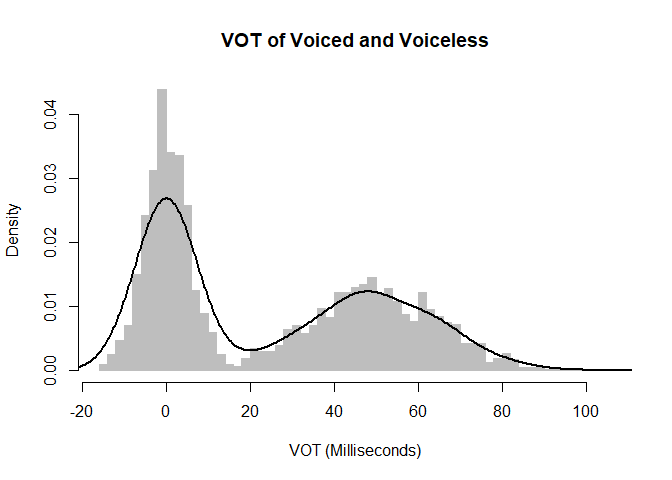
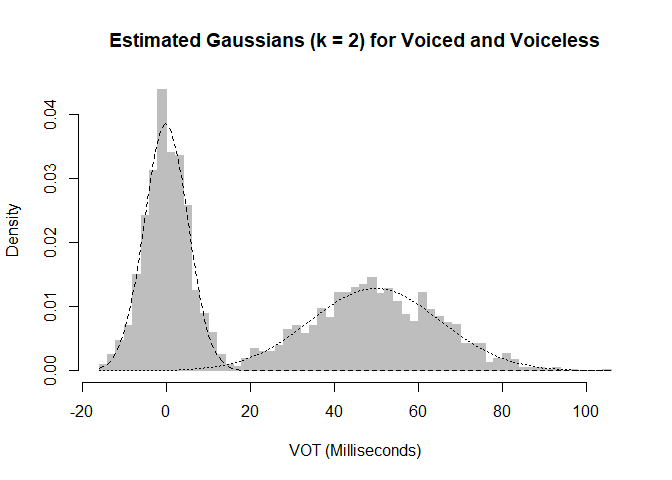

<!-- README.md is generated from README.Rmd. Please edit that file -->

# Mixture of Gaussian Models for Infants’ Statistical Learning of Speech

<!-- badges: start -->

<!-- badges: end -->

A tutorial using the R library Mixtools to model infants’ statistical
learning of speech-sound categories.

## The Model

Research suggests that infants learn speech-sound categories from
distributional features of speech cues, such as the voice onset time
(VOT) of voiced and voiceless speech sounds. One popular computational
model of this learning process is the Mixture of Gaussian (MOG) model.
In this tutorial, a MOG model, whose parameters are estimated using the
Expectation-Maximization (EM) algorithm, is used to simulate infants’
learning of speech sounds. First, a model is introduced to estimate
parameters of VOT distrbutions for voiced and voiceless speech sounds
using Expectation Maximization (EM) with a known number of categories.
Then, a hypothesis-testing approach is introduced to determine the
number of categories. The model is loosely based off of McMurray et
al. (2009) (<https://doi.org/10.1111/j.1467-7687.2009.00822.x>) and de
Boer & Kuhl (2003) (<https://doi.org/10.1121/1.1613311>). Code for
running and visualizing the MOGs was adapted from Cosma Shalizi’s
lecture on MOGs:
<https://www.stat.cmu.edu/~cshalizi/402/lectures/20-mixture-examples/lecture-20.pdf>

## Running the Model

The main R script to run the model can be found in MOG-Tutorial.R.
First, a dataframe of VOTs is created natively in R, with parameters
corresponding to voice and voiceless speech sounds, based on VOT data
cited in McMurray et al. (2009). A histogram of the simulated data
clearly shows the two speech-sound “categories” (i.e., a bi-modal
distribution of the VOT data), each representing the VOTs for voiced and
voiceless speech sounds:



``` r

# voiced parameters: mean = 0, sd = 5, lambda = 0.5
mu.vd <- 0
sd.vd <- 5
lam.vd <- 0.5

# voiceless: mean = 50, sd = 15, lambda = 0.5
mu.vl <- 50
sd.vl <- 15
lam.vl <- 0.5
```

Then, a MOG model is introduced with k = 2 Gaussians to model k = 2
speech-sound categories. The model correctly estimates the parameters of
each Gaussian used to generate the simulated data. In the figure below,
the dashed lines reflect the estimated Gaussians from the MOG model.
Here, we find that the estimated Gaussians capture the distribution of
VOTs for each speech-sound category quite
nicely:



``` r
# Hey! The fitted parameters match the parameters of the simulated data quite well.
mixmdl$mu
#> [1] -0.03625183 49.81161239
mixmdl$sigma
#> [1]  5.18875 15.54189
mixmdl$lambda
#> [1] 0.5007966 0.4992034
```

However, this is approach is not developmentally plausible, since we
know a priori what the correct value of k should be (i.e., 2 for two
speech-sound categories), while infants who are learning a spoken
language do not. Next, a hypothesis-testing approach is introduced, in
which the MOG model learns the “correct” number of k through
bootstrapping and hypothesis-testing. The p-values correspond to tests
between a model feature k categories and a model featuring k+1
categories. Here, we see that the first p-value, reflecting a model
comparision between k = 1 vs. k = 2, is significant. However, the
p-value for a model comparision k = 2 vs. k = 3 is not. Thus, the model
correctly converged to two categories.

``` r
# Hypothesis tests for k = 1 vs. k = 2 and k = 2 vs. k = 3.
mixmdl.2$p.values
#> [1] 0.00 0.92
```

## Developmental Caveats

McMurray et al. (2009) argue directly against using MOGs with the EM
algorithm to model infant statistical learning for two reasons: first,
the EM algorithm uses a large batch of input, but infants learn
iteratively (i.e., they do not get “batch” data). Second, the EM
algorithm doesn’t learn the number of Gaussians/categories (the number
is specified a priori \#), only the parameters of the Gaussians are
estimated. While here, we’ve introduced a hypothesis-testing procedure
to determine the “correct” number for k, in their paper, McMurray et
al. (2009) discard the EM alogrithm and use maximum likelihood
estimation with a competition algorithm.
